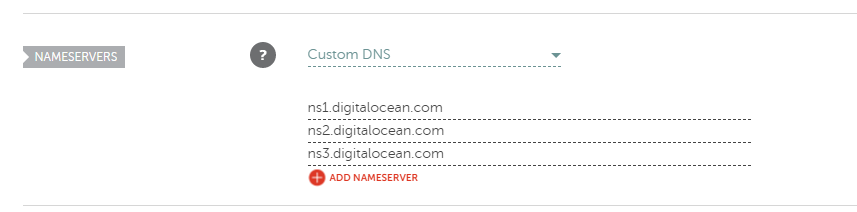
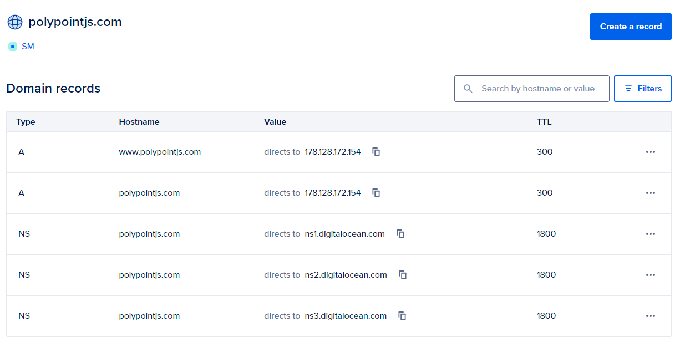

# Domain Setup

## Namecheap

Apply a "Custom DNS" setup and Point the domain to DigitalOcean nameservers:

```
ns1.digitalocean.com
ns2.digitalocean.com
ns3.digitalocean.com
```



## DigitalOcean

In the `Networking > Domains` section of the DigitalOcean control panel. Create a new domain, e.g. `polypointjs.com`.

Then create A records for `@` and `www` to point to server IP.

```
Type: A
Name: @
Value: <server-ip>
TTL: 300
```

```
Type: A
Name: www
Value: <server-ip>
TTL: 300
```

